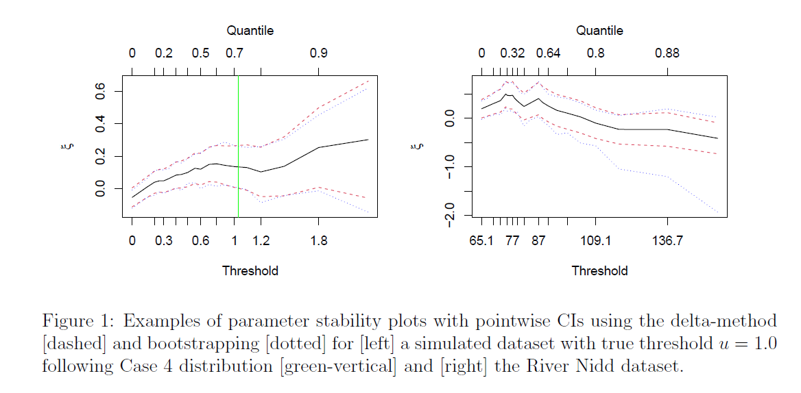

<!-- README.md is generated from README.Rmd. Please edit that file -->

```{r, include = FALSE}
knitr::opts_chunk$set(
  collapse = TRUE,
  comment = "#>"
)
```

# Automated Threshold Selection and Associated Inference Uncertainty for Univariate Extremes

This minimal repository contains R code to generate figure 1, figure 2 table 5 and table 7,  in the paper "Automated threshold selection and associated inference uncertainty for univariate extremes".

Code to reproduce all results from the main paper and supplementary material is available at this GitHub repository. (link redacted for anonymity during review)

## Required Packages

The following code snippet with install the packages required to run the code in this repository.

```{r, eval=FALSE}
required_packages <- c("evir", "ismev", "Metrics", "mgcv", "nlme", "threshr")
install.packages(required_packages)
```


## Getting Started 

### Generate Figure 1
Figure 1 of the main paper shows two examples of stability plots for the generalised Pareto distribution shape parameter, $\xi$. These plots are generated utilising code from the `evir` package which has been edited to include bootstrap-based confidence intervals in the plots. The figure contains stability plots for the River Nidd dataset and the first sample simulated from Case 4 of the simulation study. 


This figure can be generated using the file `Figure_1_example_parameter_stability_plots.R`. 

```{r}
source("Figure_1_example_parameter_stability_plots.R")
```

### Generate Figure 2

Figure 2 of the main paper shows a QQ-plot and return level estimates for the River Nidd dataset. The figure contains two panels; the first shows the QQ-plot with 95% tolerance bounds using the threshold selected by the EQD method; the second shows return level estimates with two sets of 95% confidence intervals incorporating parameter uncertainty alone and additionally, threshold uncertainty. 


This figure can be generated using the file `Figure_2_River_Nidd_analysis.R`. This file will take approximately TIME to run.

```{r}
source("Figure_2_River_Nidd_analysis.R")
```

### Generate Table 5

Table 5 of the main paper compares the EQD, Wadsworth and Northrop methods for extreme value threshold selection on Gaussian data. Thresholds are chosen using each method for 500 samples at each of two different sample sizes, $n = 2000$ and $n = 20,000$.


This table can be generated using the file `Table_5_RMSE_quantiles_gaussian.R`. 

```{r}
source("Table_5_RMSE_quantiles_gaussian.R")
```

Generating the full table takes quite some time and so we offer two meta-parameters at the top of this script to allow faster validation. 

- `GENERATE_DATA`: Generate Gaussian data and threshold estimates (`TRUE`) or use those saved in the output folder (`FALSE`)?

- `FULL_TABLE`: Generate estimates for both $n = 20,000$ and $n = 2000$ (`TRUE`) or $n = 2000$ only (`FALSE`)?

Approximate run-times are given in the table below. 

| `GENERATE_DATA` | `FULL_TABLE` | Approximate Run Time |
|-----------------|--------------|----------------------|
| FALSE           | FALSE        | 0.2 seconds          |
| FALSE           | TRUE         | 0.2 seconds          |
| TRUE            | FALSE        | 30 minutes           |
| TRUE            | TRUE         | 19.9 hours           |


### Generate Table 7

Table 7 of the main paper compares the thresholds selected by the EQD, Wadsworth and Northrop methods when applied to the river Nidd dataset for each of 7 possible candidate threshold grids. 


This table can be generated using the file `Table_7_River_Nidd_dataset_selected_thresholds.R`. This will take approximately 1 minute to run. 

```{r, warning=FALSE}
source("Table_7_River_Nidd_dataset_selected_thresholds.R")
```

# To Do 

- [ ] Add a response to the editor summarising the new submission.

- [ ] Find source of warnings in threshr code OR add explanation in README to explain warnings.

