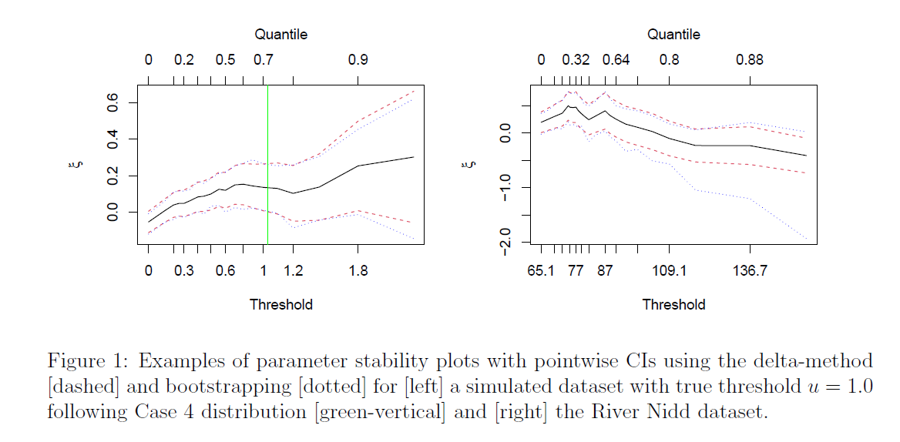
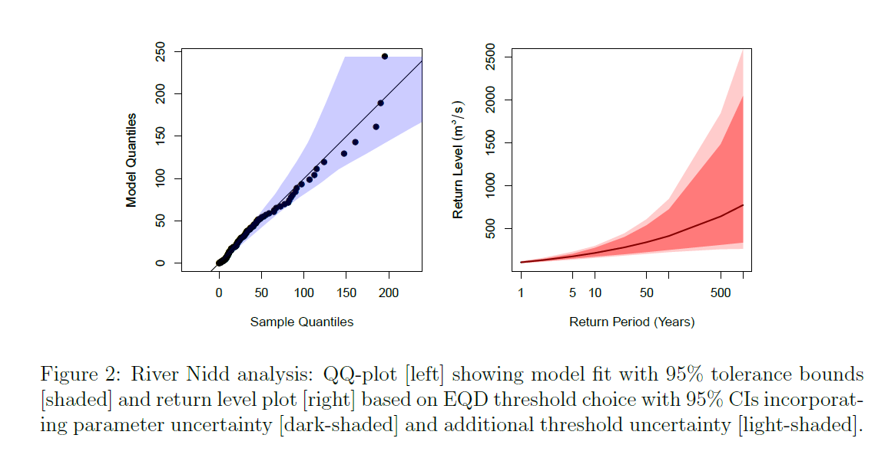
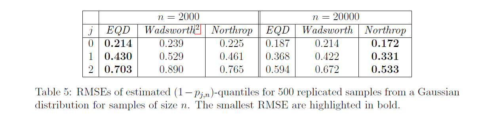
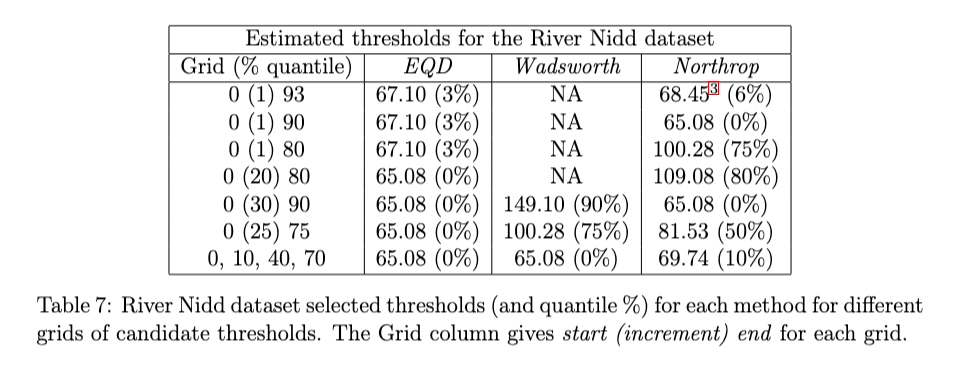

<!-- README.md is generated from README.Rmd. Please edit that file -->

# Automated Threshold Selection and Associated Inference Uncertainty for Univariate Extremes

This minimal repository contains R code to generate selected figures and
tables from the paper “Automated threshold selection and associated
inference uncertainty for univariate extremes”.

- **Figure 1:** Example parameter stability plots,
- **Figure 2:** River Nidd QQ-plot and return level estimates,
- **Table 5:** Method comparison, RMSE of quantile estimates,
- **Table 7:** Method comparison, River Nidd threshold selection.

Code to reproduce all results from the main paper and supplementary
material is available at this GitHub repository. (link redacted for
anonymity during review)

NOTE: Figure 1 and Figure 2 are generated as pdf files and saved. The
location in which they are saved is given as `FIGURE_PATH` at the top of
each of the files. Table 1 and 2 are printed to the console and also
saved as csv files.

## Required Packages

The following code snippet will install the packages required to run the
code in this repository.

``` r
required_packages <- c("evir", "ismev", "Metrics", "mgcv", "nlme", "threshr")
install.packages(required_packages)
```

## Getting Started

### Generate Figure 1

Figure 1 of the main paper shows two examples of stability plots for the
generalised Pareto distribution shape parameter, $\xi$. These plots are
generated utilising code from the `evir` package which has been edited
to include bootstrap-based confidence intervals in the plots. The figure
contains stability plots for the first sample simulated from Case 4 of
the simulation study and the River Nidd dataset.



This figure can be generated using the file
`Figure_1_example_parameter_stability_plots.R`.

``` r
source("Figure_1_example_parameter_stability_plots.R")
```

### Generate Figure 2

Figure 2 of the main paper shows a QQ-plot and return level estimates
for the River Nidd dataset. The figure contains two panels; the first
shows the QQ-plot with 95% tolerance bounds using the threshold selected
by the EQD method; the second shows return level estimates with two sets
of 95% confidence intervals incorporating parameter uncertainty alone
and additionally, threshold uncertainty.



This figure can be generated using the file
`Figure_2_River_Nidd_analysis.R`. This file will take approximately 2
hours to run.

``` r
source("Figure_2_River_Nidd_analysis.R")
```

### Generate Table 5

Table 5 of the main paper compares the EQD, Wadsworth and Northrop
methods for extreme value threshold selection on Gaussian data.
Thresholds are chosen using each method for 500 samples at each of two
different sample sizes, $n = 2000$ and $n = 20000$.



This table can be generated using the file
`Table_5_RMSE_quantiles_gaussian.R`.

NOTE: For some samples in this study, when using high candidate
thresholds, the Northrop method, for which the `threshr` package is
utilised, will output convergence warnings. These warnings are expected
and the method still selects a threshold in these cases.

``` r
source("Table_5_RMSE_quantiles_gaussian.R")
#> [1] "Sample size: 2000"
#>   j   EQD Wadsworth Northrop
#> 1 0 0.214     0.239    0.225
#> 2 1 0.430     0.529    0.461
#> 3 2 0.703     0.890    0.765
#> [1] "Sample size: 20000"
#>   j   EQD Wadsworth Northrop
#> 1 0 0.187     0.214    0.172
#> 2 1 0.368     0.422    0.331
#> 3 2 0.594     0.672    0.533
```

Generating the full table takes quite some time and so we offer two
meta-parameters at the top of this script to allow faster validation.

- `GENERATE_DATA`: Generate Gaussian data and threshold estimates
  (`TRUE`) or use those saved in the output folder (`FALSE`).

- `FULL_TABLE`: Generate estimates for both $n = 20000$ and $n = 2000$
  (`TRUE`) or $n = 2000$ only (`FALSE`).

Approximate run-times are given in the table below.

| `GENERATE_DATA` | `FULL_TABLE` | Approximate Run Time |
|-----------------|--------------|----------------------|
| FALSE           | FALSE        | 0.2 seconds          |
| FALSE           | TRUE         | 0.2 seconds          |
| TRUE            | FALSE        | 30 minutes           |
| TRUE            | TRUE         | 20 hours             |

### Generate Table 7

Table 7 of the main paper compares the thresholds selected by the EQD,
Wadsworth and Northrop methods when applied to the river Nidd dataset
for each of 7 possible candidate threshold grids.



This table can be generated using the file
`Table_7_River_Nidd_dataset_selected_thresholds.R`. This will take
approximately 1 minute to run.

NOTE: As noted in the main paper, for the first candidate grid in this
table, the Northrop method, for which the `threshr` package is utilised,
will output convergence warnings. These warnings are expected and the
method still selects a threshold in this case.

``` r
source("Table_7_River_Nidd_dataset_selected_thresholds.R")
#> Loading required package: mgcv
#> Loading required package: nlme
#> This is mgcv 1.9-0. For overview type 'help("mgcv-package")'.
#> Starting threshold selection with candidate set 1 of 7.
#>   1/3 selecting threshold using EQD method 
#>   2/3 selecting threshold using Wadsworth method 
#>   3/3 selecting threshold using Northrop method
#> Warning in (function (logf, ..., n = 1, d = 1, init = NULL, mode = NULL, : One
#> or more convergence indicators are non-zero.
#>               box     vals1      vals2 conv
#> a        1.000000  0.000000  0.0000000    0
#> b1minus -1.853995 -2.688302  0.3984474    0
#> b2minus -2.596144  5.856059 -3.9627085   52
#> b1plus   7.096490 20.581194 11.5824289    0
#> b2plus   4.202679 14.539161  9.2294245    0
#> Warning in (function (logf, ..., n = 1, d = 1, init = NULL, mode = NULL, : The Hessian of the target log-density at its mode is not positive
#>             definite. This may not be a problem, but it may be that a mode
#>             at/near a parameter boundary has been found and/or that the target
#>             function is unbounded.
#>   It might be worth using the option trans = ``BC''.
#> Warning in (function (logf, ..., n = 1, d = 1, init = NULL, mode = NULL, :
#> rotate has been changed to FALSE.
#> Warning in (function (logf, ..., n = 1, d = 1, init = NULL, mode = NULL, : One
#> or more convergence indicators are non-zero.
#>                box     vals1         vals2 conv
#> a        1.0000000   0.00000  0.000000e+00    0
#> b1minus  0.0000000   0.00000  0.000000e+00    0
#> b2minus  0.0000000   0.00000  0.000000e+00   52
#> b1plus  13.5203121  43.89700 -5.551115e-16    0
#> b2plus   0.9001546 -84.87441  1.760728e+00    0
#> Warning in (function (logf, ..., n = 1, d = 1, init = NULL, mode = NULL, : The Hessian of the target log-density at its mode is not positive
#>             definite. This may not be a problem, but it may be that a mode
#>             at/near a parameter boundary has been found and/or that the target
#>             function is unbounded.
#>   It might be worth using the option trans = ``BC''.
#> Warning in (function (logf, ..., n = 1, d = 1, init = NULL, mode = NULL, :
#> rotate has been changed to FALSE.
#> Warning in (function (logf, ..., n = 1, d = 1, init = NULL, mode = NULL, : The Hessian of the target log-density at its mode is not positive
#>             definite. This may not be a problem, but it may be that a mode
#>             at/near a parameter boundary has been found and/or that the target
#>             function is unbounded.
#>   It might be worth using the option trans = ``BC''.
#> Warning in (function (logf, ..., n = 1, d = 1, init = NULL, mode = NULL, :
#> rotate has been changed to FALSE.
#> Warning in (function (logf, ..., n = 1, d = 1, init = NULL, mode = NULL, : One
#> or more convergence indicators are non-zero.
#>                box     vals1         vals2 conv
#> a        1.0000000   0.00000  0.000000e+00    0
#> b1minus  0.0000000   0.00000  0.000000e+00    0
#> b2minus  0.0000000   0.00000  0.000000e+00   52
#> b1plus  16.8774396  58.49474 -1.554312e-15    0
#> b2plus   0.5540338 -69.19350  1.584582e+00    0
#> Starting threshold selection with candidate set 2 of 7.
#>   1/3 selecting threshold using EQD method 
#>   2/3 selecting threshold using Wadsworth method 
#>   3/3 selecting threshold using Northrop method 
#> Starting threshold selection with candidate set 3 of 7.
#>   1/3 selecting threshold using EQD method 
#>   2/3 selecting threshold using Wadsworth method 
#>   3/3 selecting threshold using Northrop method 
#> Starting threshold selection with candidate set 4 of 7.
#>   1/3 selecting threshold using EQD method 
#>   2/3 selecting threshold using Wadsworth method 
#>   3/3 selecting threshold using Northrop method 
#> Starting threshold selection with candidate set 5 of 7.
#>   1/3 selecting threshold using EQD method 
#>   2/3 selecting threshold using Wadsworth method 
#>   3/3 selecting threshold using Northrop method 
#> Starting threshold selection with candidate set 6 of 7.
#>   1/3 selecting threshold using EQD method 
#>   2/3 selecting threshold using Wadsworth method 
#>   3/3 selecting threshold using Northrop method 
#> Starting threshold selection with candidate set 7 of 7.
#>   1/3 selecting threshold using EQD method 
#>   2/3 selecting threshold using Wadsworth method 
#>   3/3 selecting threshold using Northrop method 
#>     EQD Wadsworth Northrop
#> 1 67.10        NA    68.45
#> 2 67.10        NA    65.08
#> 3 67.10        NA   100.28
#> 4 65.08        NA   109.08
#> 5 65.08    149.10    65.08
#> 6 65.08    100.28    81.53
#> 7 65.08     65.08    69.74
```
